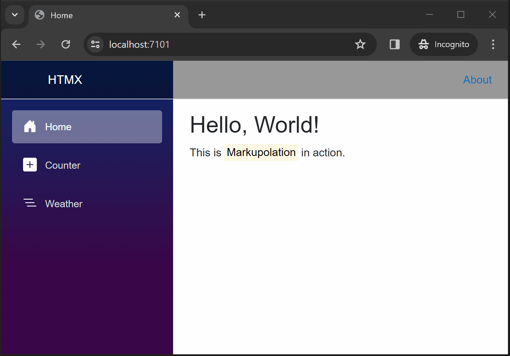

# Markupolation Sample Code<!-- omit in toc -->

> `Markupolation` and HTML Over The Wire

Content:

- [Blazor + Functions + Tye](#blazor--functions--tye)
- [HTMX + Api + YARP + Aspire](#htmx--api--yarp--aspire)
- [Console + Playwright](#console--playwright)

This code has been written with *Visual Studio 2022 [Preview](https://visualstudio.microsoft.com/vs/preview/)*.

## Blazor + Functions + Tye

> [Blazor](https://learn.microsoft.com/en-us/aspnet/core/blazor/) is a .NET frontend web framework that supports both server-side rendering and client interactivity in a single programming model.
>
> [Azure Functions](https://learn.microsoft.com/en-us/azure/azure-functions/functions-overview) is a serverless solution that allows you to write less code, maintain less infrastructure, and save on costs.
>
> [Tye](https://github.com/dotnet/tye) is a developer tool that makes developing, testing, and deploying microservices and distributed applications easier.

Blazor WebAssembly + Azure Functions:

- `Markupolation.Sample.Blazor`
- `Markupolation.Sample.Functions`

Prerequisite:

1. [Install .NET 8.0](https://dotnet.microsoft.com/download/dotnet/8.0)
2. [Install the Azure Functions Core Tools](https://learn.microsoft.com/en-us/azure/azure-functions/functions-run-local)
3. [Install Tye](https://github.com/dotnet/tye/blob/main/docs/getting_started.md#installing-tye)

Run sample:

```cmd
tye run
```

Blazor Site (Ingress):

- <https://localhost:8080>

Tye Dashboard:

- <http://localhost:8000>


## HTMX + Api + YARP + Aspire

> [htmx](https://htmx.org/) gives you access to AJAX, CSS Transitions, WebSockets and Server Sent Events directly in HTML, using attributes, so you can build modern user interfaces with the simplicity and power of hypertext.
>
> [Minimal APIs](https://learn.microsoft.com/en-us/aspnet/core/fundamentals/minimal-apis/overview) are a simplified approach for building fast HTTP APIs with ASP.NET Core.
>
> [YARP](https://github.com/microsoft/reverse-proxy) (which stands for "Yet Another Reverse Proxy") is a project to create a reverse proxy server.
>
> [.NET Aspire](https://github.com/dotnet/aspire) is an opinionated, cloud ready stack for building observable, production ready, distributed applications.

HTMX + Minimal API + YARP + .NET Aspire:

- `Markupolation.Sample.Htmx`
- `Markupolation.Sample.Api`
- `Markupolation.Sample.ApiGateway`
- `Markupolation.Sample.Aspire.AppHost`
- `Markupolation.Sample.Aspire.ServiceDefaults`

Prerequisite:

1. [Install .NET 8.0](https://dotnet.microsoft.com/download/dotnet/8.0)
2. [Install .NET Aspire workload](https://learn.microsoft.com/en-us/dotnet/aspire/setup-tooling)

Run sample:

```cmd
dotnet run --project Markupolation.Sample.Aspire.AppHost
```

HTMX Site:

- <https://localhost:7101/>

Aspire Dashboard:

- <http://localhost:15228/>



## Console + Playwright

> [Spectre.Console](https://github.com/spectreconsole/spectre.console) is a .NET library that makes it easier to create beautiful, cross platform, console applications.
>
> [Playwright for .NET](https://github.com/microsoft/playwright-dotnet) is the official language port of Playwright, the library to automate Chromium, Firefox and WebKit with a single API.

Spectre.Console + Playwright for .NET:

- `Markupolation.Sample.Examples`

Prerequisite:

1. [Install .NET 8.0](https://dotnet.microsoft.com/download/dotnet/8.0)
2. Build:
   - `dotnet build Markupolation.Sample.Examples`
3. [Install Playwright](https://playwright.dev/dotnet/docs/intro):
   - `.\bin\Debug\net8.0\playwright.ps1 install`

Run sample:

```cmd
dotnet run --project Markupolation.Sample.Examples
```


